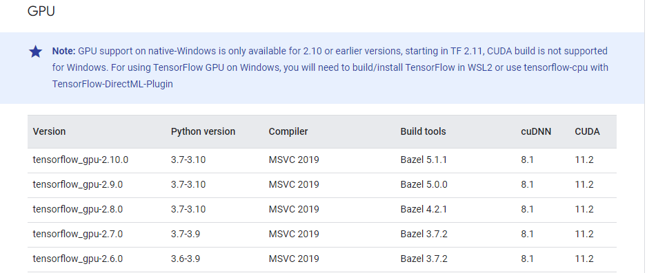
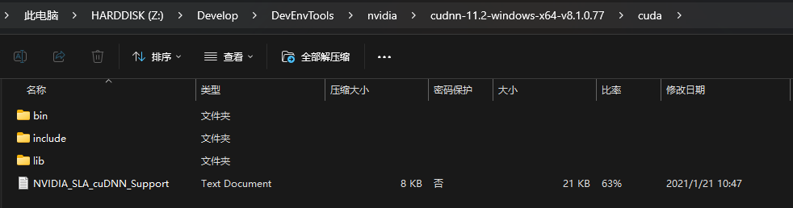
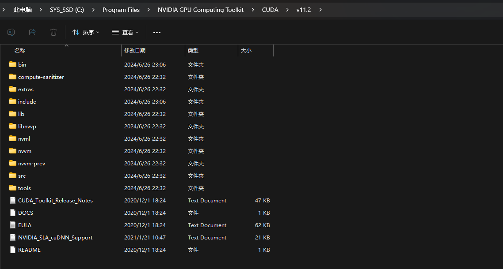

# Preparation

## Hardwares

Nvidia GPU GTX 900series or later

> NOTE: Upgrade the the gpu driver to meet the requirements by `CUDA`.
>
> E.g: `CUDA 11.2`: `>=450.80.02`

## OS

Win7 or later

## Install python

- `Tensorflow_gpu-2.10.0` : `python 3.7-3.10`
  - Details: https://www.tensorflow.org/install/source_windows
- `PyTorch`: `python >= 3.8`

## TensorFlow 2.0

https://www.tensorflow.org/install/source_windows



> NOTE: The compatibility between tool versions
>
> E.g: `tf_gpu-2.10.0` - `cuDNN:8.1` - `CUDA:11.2`

## CUDA (Compute Unified Device Architecture)

- CUDA Toolkit Archive: https://developer.nvidia.com/cuda-toolkit-archive

A parallel computing platform and application programming interface (API) model created by NVIDIA. The bridge between ML frameworks like tf, pytorch and GPU.

```shell
# check the version after installation
PS C:\> nvcc -V

nvcc: NVIDIA (R) Cuda compiler driver
Copyright (c) 2005-2020 NVIDIA Corporation
Built on Mon_Nov_30_19:15:10_Pacific_Standard_Time_2020
Cuda compilation tools, release 11.2, V11.2.67
Build cuda_11.2.r11.2/compiler.29373293_0
```

## cuDNN (CUDA Deep Neural Network library)

https://developer.nvidia.com/rdp/cudnn-archive

Provide functions like convolution, pooling and activation.



- Copy these resources into the `cuda` installation directory(Default: `C:\Program Files\NVIDIA GPU Computing Toolkit\CUDA\v11.2`) and override.



## Anaconda(Optional)

An open-source data science platform that includes multiple tools and libraries designed for Python language. Allow users to manage packages, environments and launch various tools.

`https://www.anaconda.com/download`(Need email to download distribution)

# Check

Check if gpu is available

```python
import tensorflow as tf
tf.test.is_gpu_available()
```

Output:

```php
$ [tensorflow/core/common_runtime/gpu/gpu_device.cc:1616]
Created device /device:GPU:0 with 5450 MB memory:  -> device: 0, name: NVIDIA GeForce RTX 3070, pci bus id: 0000:08:00.0, compute capability: 8.6
```
